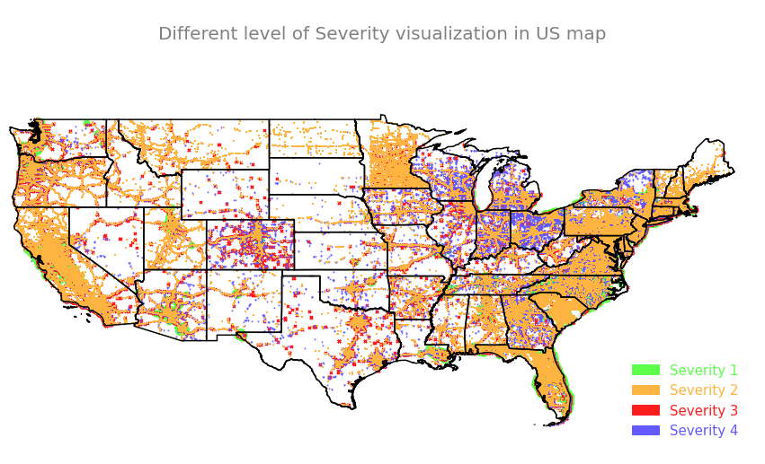
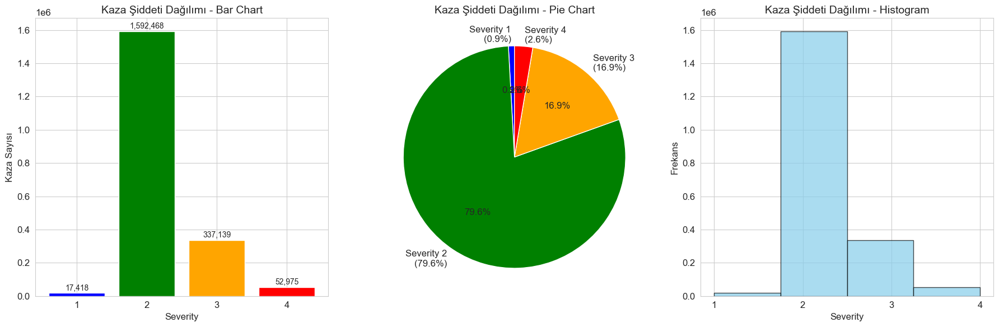
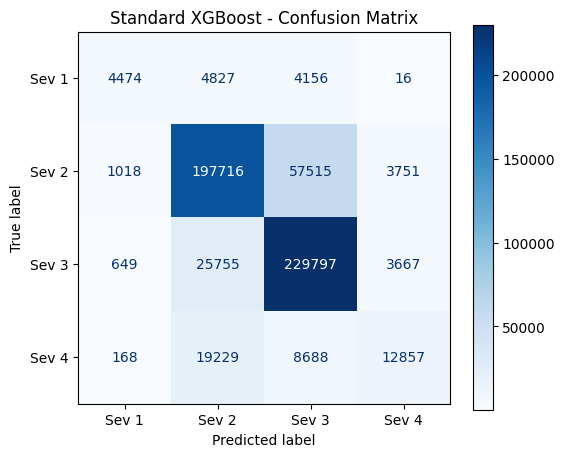
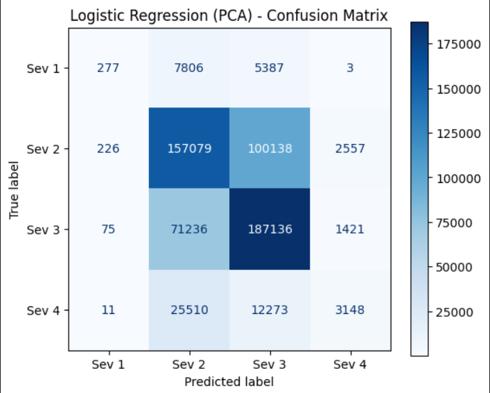
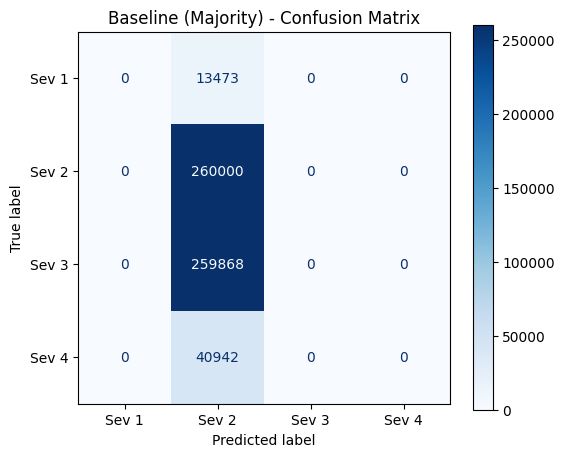
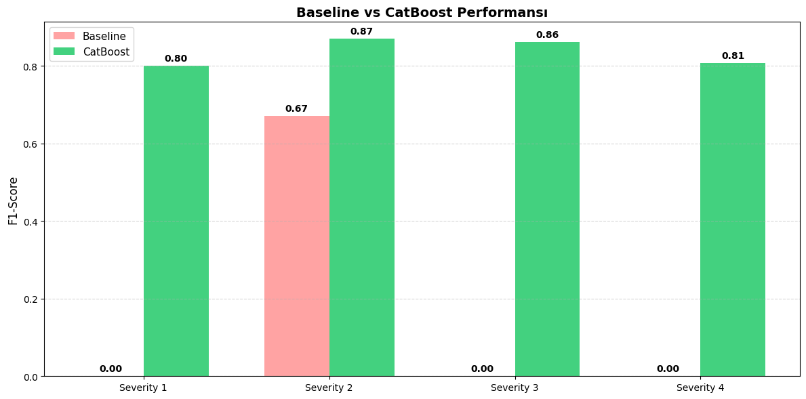

**US ABD Trafik Kazaları Şiddet Tahmini ve Analizi**


*Python ile oluşturulmuş, ABD haritası üzerinde kaza yoğunluğunu gösteren ısı haritası*

## 📌 Proje Özeti

Bu proje, ABD genelindeki trafik kazalarını içeren geniş kapsamlı bir veri seti kullanılarak kazaların şiddet derecesini (Severity 1–4) tahmin etmeyi amaçlayan bir veri madenciliği grup çalışmasıdır.

Proje kapsamında 5 kişilik ekip, veri setini farklı bakış açılarıyla ele almıştır. Her ekip üyesi:
- Farklı feature (öznitelik) grupları seçmiş
- Farklı makine öğrenmesi algoritmaları kullanmış
- Modellerin sınıflandırma performanslarını karşılaştırmıştır

**Amaç:** Kaza şiddetini en iyi açıklayan faktörleri ve en başarılı model yaklaşımlarını belirlemek.

---

## 📊 Veri Seti Hakkında

- **Kaynak:** [Kaggle – US Accidents Dataset](https://www.kaggle.com/)
- **Boyut:** ~7 Milyon Satır, 46 Sütun
- **Hedef Değişken (Target):** Severity

| Değer | Açıklama |
|-------|----------|
| 1 | Hafif |
| 2 | Orta |
| 3 | Ciddi |
| 4 | Çok Ciddi / Ölümcül |

---

## 🖼️ Veri Görselleştirmeleri

### 🎯 Hedef Değişken Dağılımı


### 🌍 Coğrafi Dağılım
*Not: Coğrafi dağılım görseli eklenecektir.*

---

## 👨‍💻 Ekip Çalışması ve Yöntemler

### 👤 Üye 1: Sıla Karahan
**Odak Alanı:** PCA ile Boyut İndirgeme & Ensemble Modeller

#### 🔍 Yaklaşım
- Yaklaşık 2 milyon örneklem üzerinde çalışılmıştır
- Hesaplama maliyetini düşürmek ve gürültüyü azaltmak için **PCA (Principal Component Analysis)** uygulanmıştır
- Toplam varyansın %95'i korunmuştur
- Güçlü ensemble modeller ile sınıflandırma yapılmıştır

#### 🧩 Seçilen Feature Grupları

**Meteorolojik:**
- Temperature (F)
- Humidity (%)
- Pressure (in)
- Visibility (mi)
- Wind Speed (mph)
- Precipitation (in)

**Zamansal (Türetilmiş):**
- Hour_of_Day
- Is_Weekend_Day
- During_Rush_Hour
- Accident_Duration_Min

**Yol & Yapı:**
- Signal_Stop_Present
- Junction
- High_Impact_Incident

*Not: Tüm bu özellikler PCA uygulanarak temel bileşenlere dönüştürülmüştür.*

#### 🤖 Kullanılan Modeller
- Majority Class Classifier (Baseline)
- Logistic Regression (PCA sonrası doğrusal ayırıcı)
- Bagging Classifier (Decision Tree tabanlı)
- XGBoost (Gradient Boosting)

#### 📈 Sonuçlar
- **Logistic Regression (PCA sonrası):**
  - Accuracy: %60.5
  - F1-Score: 0.58
- Bagging ve XGBoost modelleri ile performans artırılmıştır
- Özellikle Severity 2 ve Severity 3 sınıflarında iyileşme gözlenmiştir

**Görseller:**






#### 🛠️ Ek Not
Veri ön işleme adımları profesyonel bir pipeline yapısı ile uygulanmıştır:
- Outlier Clipping
- Missing Value Imputation
- One-Hot Encoding

---

### 👤 Üye 2: İlkay Özkan
**Odak Alanı:** Boosting Algoritmaları & Hiperparametre Optimizasyonu

#### 🔍 Yaklaşım
- Veri setindeki dengesizlik ve karmaşık ilişkiler hedeflenmiştir
- Modern Gradient Boosting algoritmaları kullanılmıştır
- GridSearchCV ile hiperparametre optimizasyonu yapılmıştır

#### 🧩 Feature Seçimi
- Model, veri setindeki tüm belirleyici özellikleri kullanmıştır
- Feature Importance analizi yapılmıştır

**Öne Çıkan Faktörler:**
- Coğrafi / Konumsal bilgiler
- Zamansal değişkenler

#### 🤖 Kullanılan Modeller
- Dummy Classifier (Baseline)
- AdaBoost Classifier
- CatBoost Classifier

#### 📈 Sonuçlar
- AdaBoost modeli optimize edilerek performans artırılmıştır
- CatBoost, en yüksek doğruluk ve ROC-AUC değerlerine ulaşmıştır
- Özellikle Severity 3 ve 4 tahminlerinde başarılıdır

**Görseller:**




---

### 👤 Üye 3: Ahmet Koç
**Odak Alanı:** Zaman ve Konum Analizi

#### 🔍 Yaklaşım
Zamansal ve mekânsal değişkenler kullanılmıştır.

#### 🧩 Seçilen Feature'lar
- Start_Time (Hour, Day, Month olarak ayrıştırıldı)
- State
- City
- Timezone

#### 🤖 Kullanılan Modeller
- K-Nearest Neighbors (KNN)
- Naive Bayes

#### 📈 Sonuç
Gece saatlerinde gerçekleşen kazaların şiddetinin, gündüze göre daha yüksek olduğu gözlemlenmiştir.

---

### 👤 Üye 4: Rabia Nur Akdaş
**Odak Alanı:** Tüm Sayısal Veriler & PCA

#### 🔍 Yaklaşım
- Veri setindeki tüm nümerik değişkenler kullanılmıştır
- PCA ile boyut indirgeme yapılmıştır

#### 🤖 Kullanılan Modeller
- XGBoost
- LightGBM

#### 📈 Sonuç
Boosting algoritmalarının bu veri setinde hem hızlı hem de yüksek performanslı olduğu görülmüştür.

---

### 👤 Üye 5: İremnur Erbaş
**Odak Alanı:** Metin Madenciliği (NLP – Description Sütunu)

#### 🔍 Yaklaşım
Description sütunu kullanılarak Doğal Dil İşleme (NLP) uygulanmıştır.

#### 🤖 Kullanılan Modeller
- TF-IDF + Random Forest
- Neural Networks (Basit YSA)

#### 📈 Sonuç
"blocked", "closed" gibi kelimelerin yüksek şiddetli kazalarla güçlü ilişkisi olduğu tespit edilmiştir.

---

## 📌 Genel Değerlendirme

- **Boosting tabanlı modeller** (CatBoost, XGBoost, LightGBM) genel olarak en başarılı yaklaşımlar olmuştur
- **Zamansal, mekânsal ve meteorolojik faktörler** kaza şiddetini doğrudan etkilemektedir
- **Metin verileri**, yardımcı fakat anlamlı katkılar sağlamıştır

---

## 🚀 Kurulum ve Kullanım

```bash
# Gerekli kütüphaneleri yükleyin
pip install -r requirements.txt

# Jupyter Notebook'u başlatın
jupyter notebook
```

---

## 📚 Kullanılan Teknolojiler

- Python 3.x
- Pandas, NumPy
- Scikit-learn
- XGBoost, LightGBM, CatBoost
- Matplotlib, Seaborn
- NLTK / Spacy (NLP için)

---

## 👥 Ekip Üyeleri

1. Sıla Karahan - PCA & Ensemble Models
2. İlkay Özkan - Boosting Algorithms
3. Ahmet Koç - Time & Location Analysis
4. Rabia Nur Akdaş - Numerical Features & PCA
5. İremnur Erbaş - NLP & Text Mining

